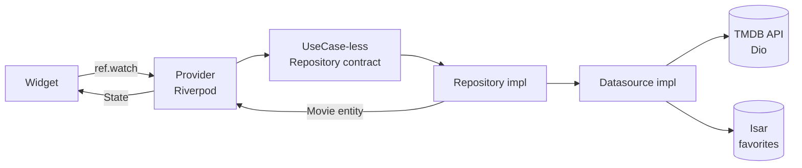

<div align="center">

# 🎬 Cinemapedia

A Flutter app to discover movies in real time, built with **Clean Architecture**.

*Una app en Flutter para descubrir películas en tiempo real, construida con **Clean Architecture**.*


</div>

---

## ✨ Features / Características

| English | Español |
|---|---|
| 📽️ Now Playing carousel with swipe gestures | 📽️ Carrusel "En cines" con gestos de deslizado |
| ➡️ Horizontal lists: In Theaters, Upcoming, Top Rated | ➡️ Listas horizontales: En cines, Próximamente, Mejor calificadas |
| 🔄 Infinite scroll in the Popular grid | 🔄 Scroll infinito en la cuadrícula de Populares |
| ❤️ Persistent favorites with **Isar** (local DB) | ❤️ Favoritos persistentes con **Isar** (base local) |
| 🎬 Detail screen: trailer, cast, overview, similar movies | 🎬 Detalle: tráiler, reparto, sinopsis, películas similares |
| 🔎 Live search with debounce (500 ms) | 🔎 Búsqueda en vivo con debounce (500 ms) |
| 🌎 All content in Spanish (es-MX) | 🌎 Todo el contenido en español (es-MX) |
| 🎞️ YouTube trailers via `youtube_player_flutter` | 🎞️ Tráilers de YouTube con `youtube_player_flutter` |

---

## 🖼️ Screenshots / Capturas

<!--
  Pega aquí tus capturas dentro de la carpeta /screenshots
  y reemplaza los nombres de archivo. Ejemplo:

  Capture.png → screenshots/home.png (Inicio)
  Capture.png → screenshots/movie.png (Detalle + tráiler)
  Capture.png → screenshots/favorites.png (Favoritos / Isar)
-->

| Home / Inicio | Movie detail / Detalle | Favorites / Favoritos |
|:---:|:---:|:---:|
|  |  |  |

---

## 🧭 Navigation / Navegación

Built with **go_router** 6.x using nested routes.

*Construida con **go_router** 6.x usando rutas anidadas.*

```
/                      → redirect →  /home/0
├── /home/:page        → 3 tabs (BottomNavigation)
│     ├── /home/0      → 🏠 Inicio (Now Playing / En cines)
│     ├── /home/1      → 🔥 Populares (infinite scroll)
│     └── /home/2      → ❤️ Favoritos (local database)
└── /home/0/movie/:id  → 🎞️ Detail screen with YouTube trailer
```

> `context.go()` replaces the location (tabs), `context.push()` stacks screens (movie detail).
>
> `context.go()` reemplaza la ubicación (tabs), `context.push()` apila pantallas (detalle de película).

---

## 🏗️ Architecture / Arquitectura

**Clean Architecture** keeping the business logic independent of frameworks and the data source.

*Arquitectura limpia que mantiene la lógica de negocio independiente de frameworks y de la fuente de datos.*

```
┌────────────────────────────┐
│        PRESENTATION        │  Widgets · Screens · Providers (Riverpod)
├────────────────────────────┤
│            DOMAIN          │  Entities · Contracts (datasource/repository)
├────────────────────────────┤
│      INFRASTRUCTURE        │  Datasources (Dio + TMDB) · Repositories
│                            │  Mappers · Isar local storage
└────────────────────────────┘
```

### Data flow / Flujo de datos



---

## 🛠️ Tech Stack / Stack Tecnológico

| Package | Version | Purpose / Propósito |
|---|---:|---|
| [dio](https://pub.dev/packages/dio) | ^5.0.0 | HTTP requests to The Movie DB / Peticiones HTTP a The Movie DB |
| [flutter_riverpod](https://pub.dev/packages/flutter_riverpod) | ^2.2.0 | State management / Manejo de estado |
| [go_router](https://pub.dev/packages/go_router) | ^6.0.9 | Declarative routing / Ruteo declarativo |
| [isar + isar_generator](https://pub.dev/packages/isar) | 3.0.5 | Local persistence (favorites) / Persistencia local (favoritos) |
| [youtube_player_flutter](https://pub.dev/packages/youtube_player_flutter) | ^10.0.1 | Trailer playback / Reproducción de tráileres |
| [card_swiper](https://pub.dev/packages/card_swiper) | ^3.0.1 | Hero carousel / Carrusel principal |
| [flutter_staggered_grid_view](https://pub.dev/packages/flutter_staggered_grid_view) | ^0.7.0 | Popular masonry grid / Cuadrícula tipo masonería |
| [animate_do](https://pub.dev/packages/animate_do) | ^3.0.2 | Micro-animations / Micro-animaciones |
| [flutter_dotenv](https://pub.dev/packages/flutter_dotenv) | ^5.0.2 | Environment variables / Variables de entorno |
| [intl](https://pub.dev/packages/intl) | ^0.20.0 | Dates and formatting / Fechas y formato |

---

## 🚀 Getting Started / Cómo empezar

### Prerequisites / Requisitos
- Flutter SDK 3.x + Dart 3.x
- A free **TMDB API key** → https://www.themoviedb.org/settings/api
- Una **API key gratuita de TMDB** (enlace arriba)

### Steps / Pasos

```bash
# 1. Clone / Clona el repositorio
git clone https://github.com/jcamilop/Cinemapedia.git
cd Cinemapedia

# 2. Install dependencies / Instala dependencias
flutter pub get

# 3. Configure your API key / Configura tu API key
#    Copy the template and fill it in / Copia la plantilla y complétala:
#    .env.template  →  .env
#
#    THE_MOVIEDB_KEY=TU_CLAVE_AQUI

# 4. (Optional) Regenerate Isar code / (Opcional) Regenera el código de Isar
dart run build_runner build --delete-conflicting-outputs

# 5. Run / Ejecuta
flutter run
```

> ⚠️ **Never commit your real `.env`** — only the `.env.template` is safe to share.
>
> ⚠️ **Nunca subas tu `.env` real** — solo `.env.template` es seguro de compartir.

---

## 📁 Project Structure / Estructura del Proyecto

```
lib/
├── config/
│   ├── constants/     # Environment (API key) / Variables de entorno
│   ├── helpers/       # human_formats (money/dates) / Utilidades de formato
│   ├── router/        # go_router routes / Rutas de go_router
│   └── theme/         # AppTheme (Material 3, seed color) / Tema
├── domain/
│   ├── datasources/   # Contracts: movies, actors, local_storage / Contratos
│   ├── entities/      # Movie, Actor, Video (Isar) / Entidades
│   └── repositories/  # Contracts MC / Contratos
├── infrastructure/
│   ├── datasources/   # moviedb_datasource (Dio), isar_datasource / Implementaciones
│   ├── mappers/       # movie, actor, video mappers / Conversores
│   ├── models/        # Moviedb response models (JSON mirrors) / Modelos JSON
│   └── repositories/  # Concrete repositories / Repositorios concretos
└── presentation/
    ├── delegates/     # SearchDelegate (debounce) / Buscador
    ├── providers/     # Riverpod providers (movies, actors, storage) / Proveedores
    ├── screens/       # Home, Movie detail / Pantallas
    ├── views/         # Home, Popular, Favorites tabs / Vistas
    └── widgets/       # Slideshow, masonry, lists, videos / Widgets
```

---

## 📚 Data Source / Fuente de Datos

- **API:** [The Movie Database (TMDB) v3](https://developer.themoviedb.org/docs/getting-started)
- **Base URL:** `https://api.themoviedb.org/3`
- **Language:** `es-MX`
- Endpoints used / Endpoints usados: `now_playing`, `upcoming`, `top_rated`, `popular`, `search/movie`, `movie/:id`, `movie/:id/videos`, `movie/:id/similar`, `movie/:id/credits`

---

## 📄 License / Licencia

[MIT](LICENSE)